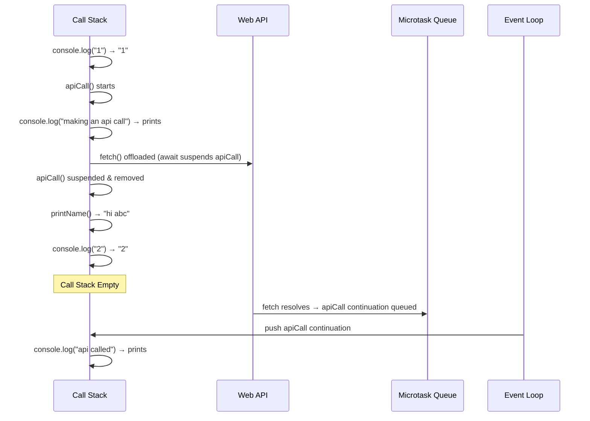

# JavaScript Runtime, Async Programming & Web Architecture

## Table of Contents

1. [JavaScript Fundamentals — Single Thread & Execution Model](#1-javascript-fundamentals--single-thread--execution-model)
2. [The Browser & JS Engine](#2-the-browser--js-engine)
3. [JS Engine Internals — Heap & Call Stack](#3-js-engine-internals--heap--call-stack)
4. [Web APIs](#4-web-apis)
5. [Synchronous vs Asynchronous Code](#5-synchronous-vs-asynchronous-code)
6. [Event Loop, Task Queue & Microtask Queue](#6-event-loop-task-queue--microtask-queue)
7. [Promises](#7-promises)
8. [async / await](#8-async--await)
9. [Complete Execution Trace — apiCall() Example](#9-complete-execution-trace--apicall-example)
10. [2-Tier Architecture](#10-2-tier-architecture)
11. [3-Tier Architecture](#11-3-tier-architecture)
12. [Comparison: 2-Tier vs 3-Tier](#12-comparison-2-tier-vs-3-tier)
13. [Final Revision Checklist](#13-final-revision-checklist)

---

## 1. JavaScript Fundamentals — Single Thread & Execution Model

### What does "Single-Threaded" mean?

JavaScript is a **single-threaded** language. This means it has **only one call stack** and can execute **only one task at a time**. It processes code **top to bottom**, one line after another.

Think of it like a single checkout counter at a grocery store — only one customer (task) can be served at a time. Everyone else must wait in line.

### Key Properties

| Property                | Description                                     |
| ----------------------- | ----------------------------------------------- |
| **Single Thread**       | One call stack, one task at a time              |
| **Top-to-Bottom**       | Code is read and executed line by line in order |
| **Blocking by default** | A slow task will block all tasks after it       |

### Why does this matter?

If JavaScript could only execute synchronously, a single heavy task (like a network call or a `for` loop with 10 billion iterations) would **freeze the entire browser** — no scrolling, no clicking, nothing. This is why asynchronous patterns exist.

```javascript
// EXAMPLE: Blocking / Synchronous
console.log("start");

for (let i = 0; i < 10000000000; i++) {} // This BLOCKS everything

console.log("middle"); // Won't print until the loop is done
console.log("end");
// Output order: start → (long pause) → middle → end
```

### Summary

> JavaScript is single-threaded and executes code top-to-bottom, one task at a time. Synchronous code is blocking — the next line cannot run until the current one finishes.

---

## 2. The Browser & JS Engine

### Architecture Overview

The **Browser** is the outer environment (the runtime container). Inside it lives the **JS Engine**, which is the actual program that reads and runs your JavaScript code.

```
  js code ──►  [ Browser  [ JS Engine ] ]  ──►  output
```

### Popular Browsers and Their Engines

| Browser                 | JS Engine                  |
| ----------------------- | -------------------------- |
| Google Chrome           | **V8**                     |
| Microsoft Edge (legacy) | **Chakra**                 |
| Microsoft Edge (modern) | **V8**                     |
| Mozilla Firefox         | **SpiderMonkey**           |
| Apple Safari            | **JavaScriptCore (Nitro)** |

> **Real-world fact:** Node.js also uses V8. This is why JavaScript can run on a server — V8 is just extracted from Chrome and embedded into Node.

### Summary

> The browser is the runtime environment that wraps the JS engine. The JS engine (like V8 in Chrome) takes your JavaScript code as input and produces output. The engine cannot do things like network requests or timers on its own — it needs the browser's Web APIs for that.

---

## 3. JS Engine Internals — Heap & Call Stack

The JS engine has two key internal components:

```
┌──────────────────────────────────┐
│            JS Engine             │
│  ┌─────────────┐ ┌─────────────┐ │
│  │    HEAP     │ │ CALL STACK  │ │
│  │             │ │             │ │
│  │  (objects,  │ │  apicall()  │ │
│  │  variables) │ │             │ │
│  └─────────────┘ └─────────────┘ │
└──────────────────────────────────┘
```

---

### 3.1 The Heap

**Definition:** The heap is an **unstructured memory region** used for dynamic memory allocation at runtime.

- All **objects**, **arrays**, **closures**, and **functions** are stored here.
- Memory is allocated when you create them (e.g., `{}`, `[]`, `new MyClass()`).
- Memory is freed automatically by the **Garbage Collector** when no references remain.

```javascript
// These are stored in the HEAP:
let user = { name: "Alice", age: 30 }; // object on heap
let items = [1, 2, 3]; // array on heap
function greet() {
  return "hi";
} // function on heap
```

---

### 3.2 The Call Stack

**Definition:** The call stack is a **LIFO (Last In, First Out)** data structure that tracks **which function is currently executing** and where to return to after it finishes.

- When a function is **called**, it is **pushed** onto the stack.
- When a function **returns**, it is **popped** off the stack.
- The JS engine only executes whatever is **on top of the stack**.

#### Step-by-Step Example

```javascript
function greet() {
  console.log("Hello!");
}

function main() {
  greet();
}

main();
```

| Step | Call Stack State                                             |
| ---- | ------------------------------------------------------------ |
| 1    | `[main()]` — main() is called                                |
| 2    | `[main(), greet()]` — greet() is called inside main          |
| 3    | `[main(), greet(), console.log()]` — console.log() is called |
| 4    | `[main(), greet()]` — console.log() finishes, popped         |
| 5    | `[main()]` — greet() finishes, popped                        |
| 6    | `[]` — main() finishes, popped. Stack is empty.              |

#### Stack Overflow

If functions call each other infinitely, the stack grows until it hits a memory limit — this causes a **Stack Overflow** error.

```javascript
function infinite() {
  infinite(); // calls itself forever
}
infinite(); // RangeError: Maximum call stack size exceeded
```

### Summary

> The **heap** stores data (objects, arrays). The **call stack** tracks execution flow. JS processes one stack frame at a time. When the stack is empty, JS is idle.

---

## 4. Web APIs

### What are Web APIs?

Web APIs are **extra capabilities provided by the browser** to the JavaScript engine. The JS engine itself has no concept of timers, HTTP requests, or the DOM. These are handed off to the browser's Web API environment, which runs them outside the JS engine (often in separate threads managed by the browser/OS).

```
┌─────────────────────────────────────────────────────────────┐
│                         Browser                             │
│                                                             │
│  ┌─────────────┐        ┌──────────────────────────────┐    │
│  │  JS Engine  │        │         Web APIs             │    │
│  │  (Heap +    │◄──────►│  setTimeout(), fetch(),      │    │
│  │  Call Stack)│        │  Promises, geolocation,      │    │
│  └─────────────┘        │  console.log(), DOM, etc.    │    │
│                         └──────────────────────────────┘    │
└─────────────────────────────────────────────────────────────┘
```

### Common Web APIs

| Web API             | Purpose                                    |
| ------------------- | ------------------------------------------ |
| `setTimeout()`      | Execute a callback after a delay           |
| `setInterval()`     | Repeatedly execute a callback at intervals |
| `fetch()`           | Make HTTP network requests                 |
| `Promises`          | Handle future async values                 |
| `console.log()`     | Output to the browser/node console         |
| `geolocation`       | Access device GPS location                 |
| `DOM API`           | Manipulate HTML elements                   |
| `Mutation Observer` | Watch for DOM changes                      |

### How it works

When the call stack encounters a Web API call (like `setTimeout`), it **offloads** the task to the browser's Web API environment and **immediately moves on** — the JS engine does not wait.

```javascript
console.log("1"); // Call Stack
setTimeout(() => {
  // Handed off to Web API (browser handles the timer)
  console.log("timer done");
}, 2000);
console.log("2"); // Call Stack continues immediately
// Output: 1 → 2 → (2 sec later) → timer done
```

### Summary

> Web APIs extend JavaScript's capabilities. When JS calls a Web API, it hands the work off to the browser and keeps executing. The callback is returned later via the Task Queue / Microtask Queue.

---

## 5. Synchronous vs Asynchronous Code

### Synchronous (Blocking) Code

**Definition:** Code where each line must **finish completely** before the next line starts. It **blocks** the thread.

```javascript
// Synchronous — BLOCKING
console.log("start");
console.log("middle"); // waits for line above
console.log("end"); // waits for line above
// Output: start → middle → end (in order, always)
```

```javascript
// Blocking example — this freezes the browser
console.log("start");
for (let i = 0; i < 10000000000; i++) {} // CPU-intensive loop BLOCKS
console.log("middle"); // won't print until loop finishes
```

**Analogy:** Ordering food at a counter where the cashier waits and stares at you while the chef cooks. Nobody else can be served.

---

### Asynchronous (Non-Blocking) Code

**Definition:** Code that **starts a task, moves on**, and handles the result later via a **callback**, **Promise**, or **async/await**.

Common async mechanisms:

- `setTimeout()` / `setInterval()`
- `fetch()` (HTTP requests)
- Promises
- `queueMicrotask()`
- Mutation Observer

```javascript
// Asynchronous — NON-BLOCKING
console.log("1");

setTimeout(() => {
  console.log("inside setTimeout"); // runs later
}, 4000);

console.log("2");
console.log("3");
// Output: 1 → 2 → 3 → (4 sec later) → inside setTimeout
```

**Analogy:** You order food, get a buzzer, and sit down. The cashier serves others. When your food is ready, the buzzer rings and you go pick it up.

---

### setTimeout with 0ms Delay

Even with a 0ms delay, `setTimeout` callbacks are **never immediate** — they always go through the Task Queue and must wait for the call stack to be empty.

```javascript
console.log("1");

setTimeout(() => {
  console.log("inside setTimeout");
}, 0); // 0ms delay — but still async!

console.log("2");
console.log("3");
// Output: 1 → 2 → 3 → inside setTimeout
// NOT: 1 → inside setTimeout → 2 → 3
```

---

### Multiple setTimeouts

```javascript
console.log("1");

setTimeout(() => {
  console.log("st1");
}, 0); // queued in Task Queue

console.log("2");

setTimeout(() => {
  console.log("st2");
}, 3000); // queued after 3s

console.log("3");

// Output: 1 → 2 → 3 → st1 → (3 sec later) → st2
```

---

### Heavy Work Inside setTimeout

Even if a `setTimeout` fires, if there's a **heavy synchronous task** inside its callback, it will still block the thread when it runs.

```javascript
console.log("1");

setTimeout(() => {
  for (let i = 0; i < 1000000000000; i++) {} // blocking loop inside callback
  console.log("for loop finished");
}, 0);

console.log("2");
console.log("3");
// Output: 1 → 2 → 3 → (long freeze) → for loop finished
```

### Summary

> Synchronous = blocking, top-to-bottom, one task at a time. Asynchronous = non-blocking, offloads the task to Web APIs, and resumes via the queue system. Even `setTimeout(fn, 0)` is async — it always yields to the call stack first.

---

## 6. Event Loop, Task Queue & Microtask Queue

### The Event Loop

**Definition:** The event loop is a **continuously running mechanism** that monitors the call stack and the queues. Its job is simple:

> **"If the call stack is empty, take the next task from the queue and push it onto the stack."**

```
LOOP:
  if (callStack is empty) {
    drain ALL microtask queue tasks first
    then take ONE task from task queue and push to call stack
  }
```

---

### Task Queue (a.k.a. Callback Queue / Macrotask Queue)

**Definition:** A FIFO queue that holds **callbacks from Web APIs** that are ready to execute.

Callbacks that go here:

- `setTimeout()` callbacks
- `setInterval()` callbacks
- DOM event handlers (click, scroll, etc.)
- `fetch()` callback (the `.then()` wrapper, though Promise resolution itself goes to microtask)

In the diagram from the notes: `st1` and `st2` (the two `setTimeout` callbacks) are sitting in the Task Queue.

---

### Microtask Queue

**Definition:** A higher-priority FIFO queue for **Promise callbacks** and `queueMicrotask()`.

Callbacks that go here:

- `.then()` / `.catch()` / `.finally()` callbacks
- `async/await` continuations (code after `await`)
- `queueMicrotask()` callbacks
- `MutationObserver` callbacks

**Critical Rule:** The Microtask Queue is **always fully drained** before the Event Loop picks the next task from the Task Queue.

```javascript
console.log("1");

setTimeout(() => console.log("setTimeout"), 0); // → Task Queue

Promise.resolve().then(() => console.log("promise")); // → Microtask Queue

console.log("2");

// Output: 1 → 2 → promise → setTimeout
// Promise (microtask) runs BEFORE setTimeout (task), even though both were queued
```

---

### Priority Order (High to Low)

```
1. Call Stack (currently executing)
2. Microtask Queue (Promises, async/await) — fully drained each loop tick
3. Task Queue (setTimeout, setInterval, events) — one task per loop tick
```

---

### Full Worked Example

```javascript
console.log("A");

setTimeout(() => console.log("B - setTimeout"), 0);

Promise.resolve().then(() => console.log("C - promise"));

queueMicrotask(() => console.log("D - microtask"));

console.log("E");

// Step-by-step:
// Call Stack runs: console.log("A")         → prints A
// Call Stack queues setTimeout callback     → Task Queue: [B]
// Call Stack queues .then callback          → Microtask Queue: [C]
// Call Stack queues queueMicrotask callback → Microtask Queue: [C, D]
// Call Stack runs: console.log("E")         → prints E
// Call Stack empty → drain Microtask Queue:
//   → prints C (promise)
//   → prints D (microtask)
// Task Queue: pick one → prints B (setTimeout)

// Final Output: A → E → C → D → B
```

### Summary

> The Event Loop bridges the Call Stack and the queues. Microtasks (Promises) always run before macrotasks (setTimeout). Never assume `setTimeout(fn, 0)` runs immediately — it always defers to after the current call stack AND all pending microtasks.

---

## 7. Promises

### What is a Promise?

**Definition:** A Promise is a **JavaScript object** that represents the **eventual completion (or failure)** of an asynchronous operation. It is a placeholder for a value that doesn't exist yet.

```
Promise States:
  pending   → operation not yet complete
  fulfilled → operation succeeded (resolve was called)
  rejected  → operation failed (reject was called)
```

### Creating a Promise

```javascript
let promise = new Promise((resolve, reject) => {
  // Async work happens here
  let a = 30;

  if (a === 30) {
    resolve({ username: "abc", userAge: 34, id: 23 }); // success
  } else {
    reject("No User Found!!!!"); // failure
  }
});

console.log("promise:", promise); // Promise { <fulfilled>: {...} }
```

---

### Consuming a Promise — `.then()` and `.catch()`

| Method               | When it runs                                         | Use case               |
| -------------------- | ---------------------------------------------------- | ---------------------- |
| `.then(callback)`    | Promise is **resolved** (success)                    | Handle the result data |
| `.catch(callback)`   | Promise is **rejected** (failure) or an error occurs | Handle errors          |
| `.finally(callback)` | Always — resolved or rejected                        | Cleanup logic          |

```javascript
promise
  .then((payload) => {
    // Runs if resolve() was called
    console.log("payload:", payload);
    // { username: "abc", userAge: 34, id: 23 }
    console.log("success");
  })
  .catch((error) => {
    // Runs if reject() was called or an error is thrown
    console.log("error:", error);
    console.log("failure");
  });
```

---

### Real-World Promise — fetch()

`fetch()` is a Web API that returns a Promise. The Promise resolves with a `Response` object.

```javascript
console.log("1");

let fetchResponse = fetch("https://fakestoreapi.com/products");
console.log("fetchResponse:", fetchResponse); // Promise { <pending> }

console.log("2");

fetchResponse
  .then((payload) => {
    // payload is a Response object — need to convert to JSON
    let jsonData = payload.json(); // .json() also returns a Promise!
    jsonData
      .then((data) => {
        console.log(data); // actual array of products
      })
      .catch((err) => {
        console.log(err);
      });
  })
  .catch((error) => {
    console.log("error:", error);
  });

// Output: 1 → 2 → (network response arrives) → [products array]
```

> **Note:** The nested `.then()` pattern above is called **Promise chaining** (or "then-catch nesting"). It works but becomes messy. This is why `async/await` was introduced.

### Summary

> A Promise represents a future value. Use `.then()` for success and `.catch()` for errors. `fetch()` returns a Promise. Nested `.then()` chains work but are harder to read — prefer `async/await` for cleaner code.

---

## 8. async / await

### What is async/await?

`async/await` is **syntactic sugar** built on top of Promises. It lets you write asynchronous code that **looks and reads like synchronous code**, eliminating complex `.then()` nesting.

### Rules

| Keyword | Where to use                                 | What it does                                                                                           |
| ------- | -------------------------------------------- | ------------------------------------------------------------------------------------------------------ |
| `async` | On a function declaration                    | Marks the function as async. The function **always returns a Promise**.                                |
| `await` | Inside an `async` function, before a Promise | **Pauses execution of the async function** until the Promise resolves. Does NOT block the main thread. |

> **Critical:** `await` only pauses the **async function** it is inside — not the entire program. Other code continues running.

---

### Rewriting fetch with async/await

```javascript
// OLD WAY — nested .then()
fetchResponse
  .then((payload) => payload.json())
  .then((data) => console.log(data))
  .catch((err) => console.log(err));

// NEW WAY — async/await (clean and readable)
async function fetchProds() {
  try {
    let fetchResponse = await fetch("https://fakestoreapi.com/products");
    // await pauses here until fetch resolves with a Response object

    let jsonData = await fetchResponse.json();
    // await pauses here until .json() resolves with parsed data

    console.log("jsonData:", jsonData);
  } catch (error) {
    // Equivalent to .catch() — handles any rejection or thrown error
    console.log("error occurred");
  }
}

fetchProds();
```

### Error Handling in async/await

Use a `try...catch` block — it catches both rejected Promises AND thrown errors.

```javascript
async function getData() {
  try {
    const response = await fetch("https://api.example.com/data");
    const data = await response.json();
    return data;
  } catch (error) {
    console.error("Something went wrong:", error);
  }
}
```

### Summary

> `async` makes a function return a Promise. `await` pauses the async function until a Promise resolves — but the rest of the program keeps running. Use `try/catch` for error handling. `async/await` is the modern, preferred way to write async code.

---

## 9. Complete Execution Trace — apiCall() Example

This is the most important worked example from the notes. It ties together the Call Stack, Web APIs, Event Loop, and async/await.

### The Code

```javascript
console.log("1"); // Line A

async function apiCall() {
  console.log("making an api call"); // Line B
  await fetch("https://fakestoreapi.com/products"); // Line C — await point
  console.log("api called"); // Line D (after await)
}

function printName() {
  console.log("hi abc"); // Line E
}

apiCall(); // Line F
printName(); // Line G
console.log("2"); // Line H
```

### Step-by-Step Execution Trace

```
Step 1: console.log("1")        → Call Stack: [console.log]  → prints "1"
Step 2: apiCall()               → Call Stack: [apiCall]
Step 3:   console.log("making an api call") → prints "making an api call"
Step 4:   await fetch(...)      → fetch() handed to Web API
                                  await SUSPENDS apiCall()
                                  apiCall() is REMOVED from call stack
                                  (it will resume when fetch resolves)
Step 5: printName()             → Call Stack: [printName]
Step 6:   console.log("hi abc") → prints "hi abc"
Step 7: printName() returns     → popped off stack
Step 8: console.log("2")        → prints "2"

--- Call Stack is now EMPTY ---

Step 9: fetch() resolves        → apiCall()'s continuation pushed to Microtask Queue
Step 10: Event Loop             → drains Microtask Queue
Step 11: apiCall() resumes      → console.log("api called") → prints "api called"
```

### Final Output

```
1
making an api call
hi abc
2
api called
```

### Visual Diagram



### Key Insight

> When `await` is hit, the async function is **suspended and removed from the call stack**. This is what makes JavaScript non-blocking — the engine is free to execute other synchronous code (like `printName()` and `console.log("2")`) while the async operation completes in the background.

---

## 10. 2-Tier Architecture

### What is 2-Tier Architecture?

A **2-tier architecture** (also called client-server architecture) is a software design pattern where the application is split into exactly **two layers**:

1. **Client (Tier 1)** — The user-facing interface
2. **Server (Tier 2)** — The backend that processes requests

There is **no database as a separate tier** — the server handles the logic and directly generates the response (no persistent data storage is involved in the communication cycle).

---

### The Client

**Definition:** The client is **any user connected to the internet** who is using a web browser or mobile app to interact with a service.

- Examples: A user opening `google.com` in Chrome, or using the Twitter mobile app.
- Technologies used to build clients: **HTML, CSS, JavaScript** (Frontend/UI).

---

### The Server

**Definition:** A server is a **combination of hardware and software** that:

1. Accepts an incoming HTTP request
2. Processes that request (runs business logic)
3. Sends back a response

- The response is a pre-computed answer — **no external database is queried** (that's what makes it 2-tier, not 3-tier).
- Examples: A simple Node.js/Express app that returns static or computed data.

---

### The Communication Protocol: HTTP

All communication between client and server happens over **HTTP (HyperText Transfer Protocol)**.

One full interaction is called a **req-res cycle** (request-response cycle):

```
Client                 HTTP                Server
  │                     │                    │
  │──── HTTP Request ──►│───────────────────►│
  │                     │   (server processes)│
  │◄─── HTTP Response ──│◄───────────────────│
  │                     │                    │
       one req-res cycle complete
```

### Summary

> In 2-tier architecture, the client sends a request, the server processes it and sends back a response — all over HTTP. No database tier is involved. It's simple but limited to static or computed responses.

---

## 11. 3-Tier Architecture

### What is 3-Tier Architecture?

A **3-tier architecture** extends the 2-tier model by adding a **third, separate tier** for data storage (the database). This is the foundation of virtually all modern web applications.

1. **Client (Tier 1)** — Frontend / UI (HTML, CSS, JS)
2. **Server (Tier 2)** — Application / Business Logic layer (Node.js, Express, etc.)
3. **Database (Tier 3)** — Data persistence layer (SQL, NoSQL, MongoDB)

---

### Tier 1: Client

- Any user on a browser or mobile app.
- Built with **HTML, CSS, JavaScript** (frontend/UI).
- Sends HTTP requests that include **data** (e.g., a login form sends username + password).

---

### Tier 2: Server (Application / Business / Middle Layer)

The server does more work than in 2-tier:

1. Receives the HTTP request from the client.
2. **Extracts and validates the data** from the request body.
3. Converts the data into a **database query**.
4. Sends the query to the database.
5. Receives the database result (true/false, rows, etc.).
6. Formats the result into an HTTP response.
7. Sends the response back to the client.

Technologies: Node.js, Express, Django, Spring Boot, etc. (application, business, middleware layer).

---

### Tier 3: Database

Stores persistent data. There are two major families:

| Type                       | Description                                            | Examples                      |
| -------------------------- | ------------------------------------------------------ | ----------------------------- |
| **SQL (Relational)**       | Structured tables with rows and columns, strict schema | MySQL, PostgreSQL, SQLite     |
| **NoSQL (Non-relational)** | Flexible schema, document/key-value/graph stores       | **MongoDB**, Redis, Cassandra |

The server sends a **query** to the database and receives a **response** (the result of the query — data rows, success/failure confirmation, etc.).

---

### Real-World Example: User Login

```
1. Client sends:  POST /login  { email: "alice@example.com", password: "secret" }
2. Server receives the request
3. Server extracts email and password
4. Server queries DB: SELECT * FROM users WHERE email = 'alice@example.com'
5. DB returns: { id: 1, email: "alice@example.com", hashedPassword: "..." }
6. Server compares password hash → match = true
7. Server sends back: HTTP 200 { token: "jwt_token_here", message: "Login successful" }
8. Client receives token and stores it
```

### Summary

> 3-tier architecture separates concerns into client, server, and database. The client sends requests with data, the server processes the request and talks to the database, and the database stores/retrieves persistent data. This is the architecture behind nearly every modern web app.

---

## 12. Comparison: 2-Tier vs 3-Tier

| Feature                  | 2-Tier                    | 3-Tier                                       |
| ------------------------ | ------------------------- | -------------------------------------------- |
| **Tiers**                | Client + Server           | Client + Server + Database                   |
| **Data persistence**     | ❌ No database            | ✅ Full database integration                 |
| **Scalability**          | Limited                   | High                                         |
| **Complexity**           | Simple                    | More complex but powerful                    |
| **Data involved in req** | No (response is computed) | Yes (data sent to/from DB)                   |
| **Use case**             | Simple static apps, tools | Virtually all modern web apps                |
| **Example**              | A static file server      | An e-commerce site (users, products, orders) |

---

## 13. Final Revision Checklist

Use this before interviews or exams to verify you understand all concepts.

### JavaScript Engine & Runtime

- [ ] Can you explain what single-threaded means and why it matters?
- [ ] Can you name the JS engine used in Chrome, Edge, Firefox, and Safari?
- [ ] Can you explain the difference between the Heap and the Call Stack?
- [ ] Can you trace the Call Stack for a multi-function program step by step?
- [ ] Can you explain what Web APIs are and why they exist separately from the engine?

### Sync vs Async

- [ ] Can you explain synchronous / blocking code with an example?
- [ ] Can you explain asynchronous / non-blocking code with an example?
- [ ] Can you predict the output of code mixing `console.log`, `setTimeout`, and Promises?
- [ ] Do you know why `setTimeout(fn, 0)` still runs AFTER synchronous code?

### Event Loop & Queues

- [ ] Can you explain what the Event Loop does in simple terms?
- [ ] Can you explain the difference between the Task Queue and Microtask Queue?
- [ ] Do you know which queue has higher priority (Microtask)?
- [ ] Can you predict output order for code with both `setTimeout` and `Promise.resolve()`?

### Promises

- [ ] Can you explain what a Promise is and its three states?
- [ ] Can you create a Promise using `new Promise(resolve, reject)`?
- [ ] Can you use `.then()` and `.catch()` correctly?
- [ ] Can you use `fetch()` and handle the response?

### async / await

- [ ] Can you explain what `async` does to a function?
- [ ] Can you explain what `await` does and what it pauses?
- [ ] Do you understand that `await` does NOT block the main thread?
- [ ] Can you rewrite a `.then()` chain using `async/await`?
- [ ] Can you use `try/catch` for error handling in async functions?

### Architecture

- [ ] Can you explain 2-tier architecture and give an example?
- [ ] Can you explain 3-tier architecture and give an example?
- [ ] Can you explain what a client is and what technologies are used to build one?
- [ ] Can you explain what a server is (hardware + software)?
- [ ] Can you explain what HTTP is and what a req-res cycle means?
- [ ] Can you name the difference between SQL and NoSQL databases?
- [ ] Can you trace a full login request through 3-tier architecture?

---

> **Tip for interviews:** For async questions, always trace the output step by step. Mention the Call Stack, Web APIs, Microtask Queue, Task Queue, and Event Loop explicitly. Interviewers love to see that you understand _why_ the output is what it is.
