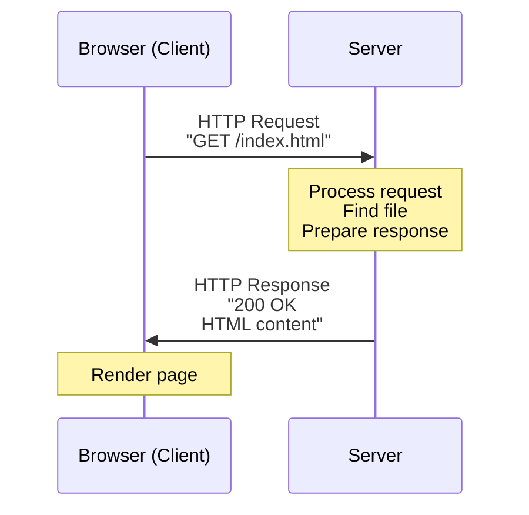
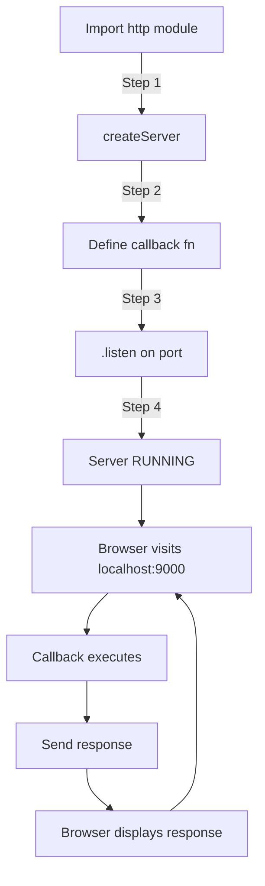

# Node.js HTTP Server — Complete Guide

### Creating Web Servers from Scratch

---

## 📚 What You'll Learn

This guide covers **everything about creating HTTP servers in Node.js**:

✅ What HTTP is and how it works  
✅ The http built-in module  
✅ All HTTP methods (GET, POST, PUT, PATCH, DELETE)  
✅ Creating a server step by step  
✅ Request object (req) — what data comes from the browser  
✅ Response object (res) — how to send data back  
✅ res.write() vs res.end()  
✅ Setting headers and status codes  
✅ Ports and localhost  
✅ Common mistakes and solutions

**Best for:** Building web servers, API development, interview preparation

---

## Table of Contents

1. [What is HTTP?](#1-what-is-http)
2. [The http Module](#2-the-http-module)
3. [HTTP Methods — GET, POST, PUT, PATCH, DELETE](#3-http-methods--get-post-put-patch-delete)
4. [Status Codes — 200, 404, 500, etc.](#4-status-codes--200-404-500-etc)
5. [Creating Your First Server — Step by Step](#5-creating-your-first-server--step-by-step)
6. [The Request Object (req)](#6-the-request-object-req)
7. [The Response Object (res)](#7-the-response-object-res)
8. [res.write() — Writing to Response](#8-reswrite--writing-to-response)
9. [res.end() — Ending the Response](#9-resend--ending-the-response)
10. [Setting Headers](#10-setting-headers)
11. [Status Codes and Content-Type](#11-status-codes-and-content-type)
12. [Ports and localhost](#12-ports-and-localhost)
13. [Server Lifecycle](#13-server-lifecycle)
14. [Complete Server Examples](#14-complete-server-examples)
15. [Common Mistakes](#15-common-mistakes)
16. [Summary](#16-summary)
17. [Revision Checklist](#17-revision-checklist)

---

## 1. What is HTTP?

### Simple Definition

**HTTP = HyperText Transfer Protocol**

It's a **set of rules** that defines how web browsers and web servers talk to each other.

Think of it like:

- **A language** that browsers and servers both understand
- **Rules of conversation** between client and server
- **A protocol** (agreed-upon format) for exchanging data

---

### How HTTP Works (Simple Flow)

```
1. You type "google.com" in your browser
   ↓
2. Browser sends HTTP REQUEST to Google's server
   "Hey Google, give me your homepage"
   ↓
3. Google's server receives the request
   ↓
4. Server sends HTTP RESPONSE back
   "Here's the HTML for my homepage"
   ↓
5. Browser receives response and displays the page
```

---

### Visual: HTTP Request-Response Cycle



---

### Real-World Analogy

**HTTP is like ordering food at a restaurant:**

```
You (Client):        "I'd like a burger, please"
                     ↓ (HTTP Request)

Waiter (Server):     [Takes order to kitchen]
                     [Kitchen prepares burger]
                     ↓ (HTTP Response)

Waiter:              "Here's your burger"

You:                 [Eat the burger]
```

---

### What HTTP Defines

HTTP is a **set of rules** that includes:

| Rule Type         | Examples                               |
| ----------------- | -------------------------------------- |
| **Methods**       | GET, POST, PUT, DELETE                 |
| **Status Codes**  | 200 (OK), 404 (Not Found), 500 (Error) |
| **Headers**       | Content-Type, Authorization, Cookies   |
| **Body**          | Data being sent (JSON, HTML, etc.)     |
| **URL Structure** | `/users/123`, `/api/products`          |

---

## 2. The http Module

### What is the http Module?

**http is a built-in Node.js module** that provides utilities to create web servers and make HTTP requests.

**Key features:**

- Create web servers (listen for browser requests)
- Make HTTP requests (like fetch)
- Handle all HTTP methods
- Manage headers, status codes, cookies

---

### Importing the http Module

```javascript
// Method 1: CommonJS
const http = require("http");

// Method 2: CommonJS with node: prefix (recommended)
const http = require("node:http");

// Method 3: ES Modules
import http from "http";
import http from "node:http"; // Recommended
```

---

### What's Inside the http Module?

```javascript
import http from "node:http";

console.log(http);

// Contains:
// - createServer() → Create a web server
// - request() → Make HTTP requests
// - get() → Make GET requests
// - METHODS → Array of all HTTP methods
// - STATUS_CODES → Object with all status codes
// And more...
```

---

### Why Use the http Module?

| Use Case                    | Why http Module                              |
| --------------------------- | -------------------------------------------- |
| **Create web server**       | Listen for browser requests, serve web pages |
| **Build REST API**          | Handle GET, POST, PUT, DELETE requests       |
| **Serve static files**      | Send HTML, CSS, JS, images to browsers       |
| **Handle form submissions** | Receive POST data from forms                 |
| **Create microservices**    | Small, focused servers                       |

---

## 3. HTTP Methods — GET, POST, PUT, PATCH, DELETE

### What Are HTTP Methods?

**HTTP methods** (also called HTTP verbs) define **what action** you want to perform.

Think of them like **verbs in a sentence**:

- **GET** = "Give me" (fetch data)
- **POST** = "Create this" (add new data)
- **PUT** = "Replace this" (update everything)
- **PATCH** = "Modify this" (update part)
- **DELETE** = "Remove this" (delete data)

---

### The Main 5 Methods

```
GET    → Fetch/retrieve data
POST   → Create new data
PUT    → Update/replace entire resource
PATCH  → Update part of resource
DELETE → Remove data
```

---

### 1. GET — Fetch Data

**What it does:** Retrieves data from the server (doesn't modify anything)

**Use cases:**

- Load a web page
- Fetch list of users
- Get product details
- Search results

**Example:**

```javascript
// Browser makes GET request
GET /users
GET /products/123
GET /search?q=laptop

// Server sends data back (doesn't change anything on server)
```

**Real-world analogy:** Looking at a book in a library (doesn't change the book)

---

### 2. POST — Create New Data

**What it does:** Sends data to the server to create something new

**Use cases:**

- Submit a form
- Create new user account
- Add item to shopping cart
- Upload a file

**Example:**

```javascript
// Browser sends POST request with data
POST /users
Body: { name: "John", email: "john@example.com" }

// Server creates new user and responds
Response: { id: 123, name: "John", email: "john@example.com" }
```

**Real-world analogy:** Adding a new book to a library shelf

---

### 3. PUT — Replace Entire Resource

**What it does:** Replaces an entire resource with new data

**Use cases:**

- Update entire user profile
- Replace document contents
- Reset all settings

**Example:**

```javascript
// Replace entire user #123
PUT /users/123
Body: { name: "Jane", email: "jane@example.com", age: 30 }

// Server replaces ALL fields (even if you don't send some, they become null)
```

**Real-world analogy:** Replacing an entire book with a new edition

---

### 4. PATCH — Update Part of Resource

**What it does:** Updates only specific fields (partial update)

**Use cases:**

- Change user's email only
- Update product price only
- Modify one setting

**Example:**

```javascript
// Update only the email of user #123
PATCH / users / 123;
Body: {
  email: "newemail@example.com";
}

// Server updates ONLY the email (other fields stay the same)
```

**Real-world analogy:** Correcting a typo on one page of a book

---

### 5. DELETE — Remove Data

**What it does:** Deletes a resource

**Use cases:**

- Delete user account
- Remove item from cart
- Cancel order

**Example:**

```javascript
// Delete user #123
DELETE /users/123

// Server removes the user and responds
Response: 204 No Content
```

**Real-world analogy:** Removing a book from the library

---

### Quick Reference Table

| Method     | Purpose        | Changes Data? | Example URL             |
| ---------- | -------------- | ------------- | ----------------------- |
| **GET**    | Fetch/retrieve | ❌ No         | `/users`, `/products/5` |
| **POST**   | Create new     | ✅ Yes        | `/users`, `/orders`     |
| **PUT**    | Replace entire | ✅ Yes        | `/users/123`            |
| **PATCH**  | Update part    | ✅ Yes        | `/users/123`            |
| **DELETE** | Remove         | ✅ Yes        | `/users/123`            |

---

### CRUD Mapping

```
CRUD Operation → HTTP Method

Create → POST
Read   → GET
Update → PUT or PATCH
Delete → DELETE
```

---

## 4. Status Codes — 200, 404, 500, etc.

### What Are Status Codes?

**Status codes** are 3-digit numbers that tell you **what happened** with the request.

Think of them like:

- **Receipt codes** at a store (approved, declined, error)
- **Traffic lights** (green = go, red = stop, yellow = wait)
- **Grade reports** (A = excellent, F = failed)

---

### The 5 Categories

```
1xx → Informational (rare)
2xx → Success
3xx → Redirection
4xx → Client error (your mistake)
5xx → Server error (server's mistake)
```

---

### Most Common Status Codes

| Code    | Name                  | Meaning                           | When It Happens                      |
| ------- | --------------------- | --------------------------------- | ------------------------------------ |
| **200** | OK                    | Everything worked!                | Successful GET/POST/PUT/PATCH        |
| **201** | Created               | New resource created              | Successful POST                      |
| **204** | No Content            | Success, but no data to send back | Successful DELETE                    |
| **400** | Bad Request           | You sent invalid data             | Missing required fields              |
| **401** | Unauthorized          | You need to log in                | No auth token                        |
| **403** | Forbidden             | You don't have permission         | Trying to delete someone else's data |
| **404** | Not Found             | Resource doesn't exist            | Invalid URL                          |
| **500** | Internal Server Error | Server crashed/bug                | Code error on server                 |
| **503** | Service Unavailable   | Server overloaded/down            | Too many requests                    |

---

### Status Code Examples

#### 200 OK — Success

```javascript
GET /users/123

Response:
  Status: 200 OK
  Body: { id: 123, name: "John" }
```

#### 201 Created — New Resource

```javascript
POST /users
Body: { name: "Alice" }

Response:
  Status: 201 Created
  Body: { id: 456, name: "Alice" }
```

#### 404 Not Found — Resource Missing

```javascript
GET /users/999

Response:
  Status: 404 Not Found
  Body: { error: "User not found" }
```

#### 500 Internal Server Error — Server Bug

```javascript
GET /users

Response:
  Status: 500 Internal Server Error
  Body: { error: "Database connection failed" }
```

---

### Real-World Analogy

**Status codes are like delivery notifications:**

```
200 OK           → Package delivered successfully
201 Created      → New account created
400 Bad Request  → Invalid address format
404 Not Found    → Address doesn't exist
500 Server Error → Delivery truck broke down
```

---

## 5. Creating Your First Server — Step by Step

### The 5 Steps

```
Step 1: Import http module
Step 2: Create server with createServer()
Step 3: Pass callback function with (req, res)
Step 4: Assign port number with listen()
Step 5: Handle requests in the callback
```

---

### Step 1: Import http

```javascript
import http from "node:http";
```

---

### Step 2: Create Server

```javascript
const server = http.createServer((req, res) => {
  // This function runs EVERY TIME someone visits your server
});
```

---

### Step 3: The Callback Function

```javascript
http.createServer((req, res) => {
  // req = Request object (what the browser sent)
  // res = Response object (what we send back)
});
```

---

### Step 4: Assign Port and Start Server

```javascript
http
  .createServer((req, res) => {
    // Handle request
  })
  .listen(9000, (err) => {
    if (err) {
      console.log("Problem starting server");
    } else {
      console.log("Server running at port 9000");
    }
  });
```

---

### Step 5: Send Response

```javascript
http
  .createServer((req, res) => {
    res.end("Hello World!");
  })
  .listen(9000, () => {
    console.log("Server running at port 9000");
  });
```

---

### Complete First Server

```javascript
import http from "node:http";

http
  .createServer((req, res) => {
    res.end("Hello from Node.js server!");
  })
  .listen(9000, () => {
    console.log("Server running at http://localhost:9000");
  });
```

**To run:**

```bash
node server.js
```

**To access:**

```
Open browser → http://localhost:9000
```

**You'll see:** "Hello from Node.js server!"

---

### Visual: Server Lifecycle



---

## 6. The Request Object (req)

### What is the Request Object?

**req is a readable stream object** that contains **all the information** the browser sent to your server.

Think of it like:

- **A package** from the browser (contains all the details)
- **A form** filled out by the client
- **An envelope** with sender info and contents

---

### Key Properties of req

| Property      | What It Contains          | Example                                  |
| ------------- | ------------------------- | ---------------------------------------- |
| `req.url`     | The path/route requested  | `/users`, `/about`                       |
| `req.method`  | HTTP method used          | `GET`, `POST`, `PUT`                     |
| `req.headers` | Request headers           | `{ 'content-type': 'application/json' }` |
| `req.body`    | Data sent in request body | `{ name: "John" }` (needs parsing)       |

---

### req.headers — Additional Info

```javascript
http
  .createServer((req, res) => {
    console.log("Headers:", req.headers);
    res.end("OK");
  })
  .listen(9000);
```

**Output:**

```javascript
{
  'user-agent': 'Mozilla/5.0 Chrome/120.0',
  'accept': 'text/html',
  'accept-language': 'en-US',
  'host': 'localhost:9000',
  'connection': 'keep-alive'
}
```

---

## 7. The Response Object (res)

### What is the Response Object?

**res is a writable stream object** that contains **methods to send data back** to the browser.

Think of it like:

- **The reply** you send back
- **The waiter** bringing your food
- **The response envelope** you fill out

---

### Key Methods of res

| Method            | Purpose                                          | Example                                              |
| ----------------- | ------------------------------------------------ | ---------------------------------------------------- |
| `res.write()`     | Write data to response (can call multiple times) | `res.write("Hello")`                                 |
| `res.end()`       | End the response (and optionally send data)      | `res.end("Done")`                                    |
| `res.setHeader()` | Set response headers                             | `res.setHeader('Content-Type', 'text/html')`         |
| `res.writeHead()` | Set status code + headers at once                | `res.writeHead(200, {'Content-Type': 'text/plain'})` |

---

### Visual: Request-Response Objects

```
Browser sends:                Server receives:
────────────────              ────────────────
GET /about HTTP/1.1    →      req.url = "/about"
Host: localhost:9000   →      req.method = "GET"
User-Agent: Chrome     →      req.headers = {...}


Server sends:                 Browser receives:
────────────────              ────────────────
HTTP/1.1 200 OK        ←      Status: 200
Content-Type: text/html ←     Header info
                       ←
<h1>About</h1>         ←      Body content
```

---

## 8. res.write() — Writing to Response

### What Does res.write() Do?

**Sends a chunk of data** to the browser **without closing the connection**.

Think of it like:

- **Writing sentences** one by one
- **Sending data in pieces**
- **Streaming content**

---

### Basic Usage

```javascript
http
  .createServer((req, res) => {
    res.write("First chunk of data\n");
    res.write("Second chunk of data\n");
    res.write("Third chunk of data\n");
    res.end(); // Must call end() to finish
  })
  .listen(9000);
```

**Browser sees:**

```
First chunk of data
Second chunk of data
Third chunk of data
```

---

### Multiple Writes

```javascript
http
  .createServer((req, res) => {
    res.write("<html>");
    res.write("<head><title>My Page</title></head>");
    res.write("<body>");
    res.write("<h1>Hello World</h1>");
    res.write("<p>This is a paragraph</p>");
    res.write("</body>");
    res.write("</html>");
    res.end();
  })
  .listen(9000);
```

**Important:** Must call `res.end()` when done!

---

### ⚠️ Cannot Write After end()

```javascript
http
  .createServer((req, res) => {
    res.write("Hello");
    res.end();

    res.write("More data"); // ❌ ERROR!
    // Error: Cannot write after end
  })
  .listen(9000);
```

**Rule:** Once you call `res.end()`, the response is **closed** — you can't write anymore.

---

## 9. res.end() — Ending the Response

### What Does res.end() Do?

**Closes the request-response cycle** and **optionally sends final data**.

Think of it like:

- **Hanging up the phone** (conversation is over)
- **Closing the letter** before sending
- **Finishing the response**

---

### Using res.end() to Send Data

```javascript
http
  .createServer((req, res) => {
    res.end("This is from end()");
  })
  .listen(9000);
```

**Equivalent to:**

```javascript
http
  .createServer((req, res) => {
    res.write("This is from end()");
    res.end();
  })
  .listen(9000);
```

---

### res.write() + res.end() Pattern

```javascript
http
  .createServer((req, res) => {
    res.write("Hello ");
    res.write("World ");
    res.end("!"); // Last piece of data + close

    // Browser sees: "Hello World !"
  })
  .listen(9000);
```

---

### res.end() Must Be Called

```javascript
// ❌ BAD — Missing res.end()
http
  .createServer((req, res) => {
    res.write("Hello");
    // Missing res.end()!
  })
  .listen(9000);

// Browser will keep waiting forever (loading spinner never stops)
```

**Always remember to call `res.end()`!**

---

### Visual: Write vs End

```
Response Stream (writable):
────────────────────────────────────────
res.write("Part 1")  → [████]
res.write("Part 2")  → [████]
res.write("Part 3")  → [████]
res.end("Done")      → [████] [CLOSE]
                        ↑
                    Connection closed
                    Browser stops waiting
```

---

## 10. Setting Headers

### What Are Headers?

**Headers are metadata** about the response — extra information that tells the browser how to handle the data.

Think of headers like:

- **Labels on a package** (fragile, perishable, etc.)
- **Envelope markings** (priority mail, certified, etc.)
- **Instructions** for the browser

---

### Common Headers

| Header           | Purpose                        | Example                         |
| ---------------- | ------------------------------ | ------------------------------- |
| `Content-Type`   | Type of data being sent        | `text/html`, `application/json` |
| `Content-Length` | Size of response body          | `1024` (bytes)                  |
| `Set-Cookie`     | Set browser cookies            | `sessionId=abc123`              |
| `Cache-Control`  | How to cache the response      | `no-cache`, `max-age=3600`      |
| `Location`       | Redirect URL (with 3xx status) | `/new-page`                     |

---

### Method 1: res.statusCode + res.setHeader()

```javascript
http
  .createServer((req, res) => {
    // Set status code
    res.statusCode = 201;

    // Set headers one by one
    res.setHeader("Content-Type", "text/plain");
    res.setHeader("My-Custom-Header", "some value");

    res.end("Resource created!");
  })
  .listen(9000);
```

---

### Method 2: res.writeHead() (All at Once)

```javascript
http
  .createServer((req, res) => {
    // Set status + headers in one call
    res.writeHead(200, {
      "Content-Type": "text/html",
      "X-Powered-By": "Node.js",
    });

    res.end("<h1>Hello World</h1>");
  })
  .listen(9000);
```

---

### Content-Type Examples

```javascript
// Plain text
res.setHeader("Content-Type", "text/plain");
res.end("Hello World");

// HTML
res.setHeader("Content-Type", "text/html");
res.end("<h1>Hello World</h1>");

// JSON
res.setHeader("Content-Type", "application/json");
res.end(JSON.stringify({ message: "Hello" }));

// CSS
res.setHeader("Content-Type", "text/css");
res.end("body { color: red; }");

// JavaScript
res.setHeader("Content-Type", "application/javascript");
res.end("console.log('Hello');");
```

---

### Custom Headers

```javascript
http
  .createServer((req, res) => {
    res.setHeader("X-Response-Time", "50ms");
    res.setHeader("X-Server-Name", "MyServer");
    res.setHeader("X-Custom-Header", "any value");

    res.end("OK");
  })
  .listen(9000);
```

**Note:** Custom headers often start with `X-`

---

## 11. Status Codes and Content-Type

### Setting Status Code

**Method 1: res.statusCode**

```javascript
http
  .createServer((req, res) => {
    res.statusCode = 404;
    res.end("Page not found");
  })
  .listen(9000);
```

**Method 2: res.writeHead()**

```javascript
http
  .createServer((req, res) => {
    res.writeHead(404, { "Content-Type": "text/plain" });
    res.end("Page not found");
  })
  .listen(9000);
```

---

## 12. Ports and localhost

### What is a Port?

**A port is a number** (0-65535) that identifies a **specific door** on your computer for network communication.

Think of it like:

- **Apartment numbers** in a building (building = your computer, apartments = ports)
- **TV channels** (computer = TV, port = channel number)
- **Phone extensions** (company = computer, extension = port)

---

### Common Ports

| Port      | Service                   |
| --------- | ------------------------- |
| **80**    | HTTP (web traffic)        |
| **443**   | HTTPS (secure web)        |
| **3000**  | Common for Node.js dev    |
| **5000**  | Common for Python/Flask   |
| **8080**  | Alternative HTTP          |
| **9000**  | Custom (what we're using) |
| **27017** | MongoDB                   |
| **5432**  | PostgreSQL                |

---

### localhost

**localhost = Your own computer**

```
localhost     = 127.0.0.1 (IP address)
Both mean:    "This computer"
```

**Accessing your server:**

```
http://localhost:9000
http://127.0.0.1:9000

Both work the same way!
```

---

### Choosing a Port

```javascript
// Port 3000 (common choice)
.listen(3000);

// Port 8000
.listen(8000);

// Port 9000 (our choice)
.listen(9000);
```

**Rules:**

- Use ports above 1024 (below reserved for system)
- Common dev ports: 3000, 5000, 8000, 8080
- Pick any available port

---

### Port Already in Use Error

```bash
$ node server.js
Error: listen EADDRINUSE: address already in use :::9000
```

**Cause:** Another program is using port 9000

**Solutions:**

```bash
# Solution 1: Use different port
.listen(3000)  # Instead of 9000

# Solution 2: Kill the process using port 9000
# Linux/Mac:
lsof -i :9000
kill -9 <PID>

# Windows:
netstat -ano | findstr :9000
taskkill /PID <PID> /F
```

---

## 13. Server Lifecycle

### Starting the Server

```bash
$ node server.js
Server running at http://localhost:9000
```

**Server is now RUNNING** — waiting for requests

---

### Making Requests

```
Browser → http://localhost:9000
          ↓
Server receives request
          ↓
Callback function executes
          ↓
Server sends response
          ↓
Browser displays response
```

---

### Modifying Server Code

```javascript
// server.js (Version 1)
http
  .createServer((req, res) => {
    res.end("Hello World");
  })
  .listen(9000);
```

**Change code:**

```javascript
// server.js (Version 2)
http
  .createServer((req, res) => {
    res.end("Hello Universe"); // Changed!
  })
  .listen(9000);
```

**⚠️ Changes NOT reflected until restart!**

---

### Restarting the Server

```bash
# Step 1: Stop server
Press Ctrl + C

# Output:
^C
Server stopped

# Step 2: Start again
$ node server.js
Server running at http://localhost:9000

# Now changes are visible!
```

---

### Auto-Restart with nodemon

**Problem:** Manually restarting is tedious

**Solution:** Use nodemon (auto-restarts on file changes)

```bash
# Install nodemon globally
npm install -g nodemon

# Run with nodemon instead of node
nodemon server.js

# Now: Save file → Auto-restart!
```

---

## 14. Complete Server Examples

### Example 1: Simple Text Server

```javascript
import http from "node:http";

http
  .createServer((req, res) => {
    res.writeHead(200, { "Content-Type": "text/plain" });
    res.end("Hello from Node.js server!");
  })
  .listen(9000, () => {
    console.log("Server running at http://localhost:9000");
  });
```

---

## 15. Common Mistakes

### Mistake 1: Forgetting res.end()

```javascript
// ❌ WRONG — Browser hangs forever
http
  .createServer((req, res) => {
    res.write("Hello");
    // Missing res.end()!
  })
  .listen(9000);

// ✅ CORRECT
http
  .createServer((req, res) => {
    res.write("Hello");
    res.end();
  })
  .listen(9000);
```

---

### Mistake 2: Writing After end()

```javascript
// ❌ WRONG — Error!
http
  .createServer((req, res) => {
    res.end("Done");
    res.write("More"); // ERROR: Can't write after end
  })
  .listen(9000);

// ✅ CORRECT
http
  .createServer((req, res) => {
    res.write("Hello");
    res.end("Done");
  })
  .listen(9000);
```

---

### Mistake 3: Not Restarting Server

```javascript
// Changed code in server.js
// But server still shows old version

// ❌ WRONG: Refresh browser expecting changes
// Changes don't appear

// ✅ CORRECT: Restart server first
// Ctrl + C → node server.js
```

---

### Mistake 4: Port Already in Use

```bash
$ node server.js
Error: EADDRINUSE

# ✅ SOLUTION 1: Kill process
# Find process on port 9000 and kill it

# ✅ SOLUTION 2: Use different port
.listen(3000)  // Use 3000 instead
```

---

### Mistake 5: Wrong Content-Type

```javascript
// ❌ WRONG — Sends JSON but says text/plain
http
  .createServer((req, res) => {
    res.setHeader("Content-Type", "text/plain");
    res.end(JSON.stringify({ name: "John" }));
    // Browser doesn't know it's JSON!
  })
  .listen(9000);

// ✅ CORRECT
http
  .createServer((req, res) => {
    res.setHeader("Content-Type", "application/json");
    res.end(JSON.stringify({ name: "John" }));
  })
  .listen(9000);
```

---

## 16. Summary — Key Takeaways

### 🎯 HTTP Basics

| Concept          | Key Point                                    |
| ---------------- | -------------------------------------------- |
| **HTTP**         | Protocol for browser-server communication    |
| **http module**  | Built-in Node.js module for creating servers |
| **Methods**      | GET, POST, PUT, PATCH, DELETE                |
| **Status codes** | 200 OK, 404 Not Found, 500 Error, etc.       |

---

### 📡 Creating Servers

```javascript
// The 5 steps:
1. import http from 'node:http';
2. http.createServer((req, res) => {
3.   // req = request from browser
4.   res.end("Response");
5. }).listen(9000);
```

---

### 🔄 Request-Response

```
req object (readable):
  - req.url → The path
  - req.method → GET, POST, etc.
  - req.headers → Additional info

res object (writable):
  - res.write() → Send data (can call multiple times)
  - res.end() → Finish response (MUST call)
  - res.setHeader() → Set headers
  - res.writeHead() → Set status + headers
```

---

### ⚠️ Critical Rules

```
✅ ALWAYS call res.end()
❌ NEVER write after res.end()
✅ Restart server after code changes
✅ Set correct Content-Type
✅ Use appropriate status codes
```

---

## 17. Revision Checklist

### HTTP Basics

- [ ] Can you explain what HTTP is?
- [ ] Can you name all 5 main HTTP methods?
- [ ] Do you know what GET is for?
- [ ] Do you know what POST is for?
- [ ] Can you name 5 status codes?

### Server Creation

- [ ] Can you list the 5 steps to create a server?
- [ ] Can you import the http module?
- [ ] Can you use http.createServer()?
- [ ] Can you use .listen() with a port?
- [ ] Do you know what localhost means?

### Request Object

- [ ] Do you know req is a readable stream?
- [ ] Can you access req.url?
- [ ] Can you access req.method?
- [ ] Can you route based on req.url?
- [ ] Can you check req.method for different handling?

### Response Object

- [ ] Do you know res is a writable stream?
- [ ] Can you use res.write()?
- [ ] Can you use res.end()?
- [ ] Do you know the difference between write and end?
- [ ] Do you know you can't write after end?

### Headers

- [ ] Can you set headers with res.setHeader()?
- [ ] Can you set headers with res.writeHead()?
- [ ] Do you know what Content-Type is?
- [ ] Can you set status code with res.statusCode?
- [ ] Can you send JSON with correct headers?

### Lifecycle

- [ ] Do you know how to start the server?
- [ ] Do you know how to stop the server (Ctrl+C)?
- [ ] Do you know you must restart after changes?
- [ ] Do you know about nodemon for auto-restart?
- [ ] Can you access your server in a browser?

---

> **🎤 Interview Tip — "How would you create a simple REST API using Node.js http module?"**
>
> **Answer like this:**
>
> _"I'd use the built-in http module to create a server with http.createServer(). The callback receives two parameters — req for the incoming request and res for the outgoing response._
>
> _For a REST API, I'd check both req.method and req.url to route requests. For example, a GET request to /api/users would retrieve users, while a POST to the same endpoint would create a new user. I'd use different status codes — 200 for successful GET, 201 for created resources from POST, 404 for not found, and 500 for server errors._
>
> _For responses, I'd set the Content-Type header to application/json and use res.end() with JSON.stringify() to send data. Here's a simple example:_
>
> ```javascript
> http
>   .createServer((req, res) => {
>     if (req.method === "GET" && req.url === "/api/users") {
>       res.writeHead(200, { "Content-Type": "application/json" });
>       res.end(JSON.stringify([{ id: 1, name: "Alice" }]));
>     } else if (req.method === "POST" && req.url === "/api/users") {
>       res.writeHead(201, { "Content-Type": "application/json" });
>       res.end(JSON.stringify({ id: 2, name: "Bob" }));
>     } else {
>       res.writeHead(404);
>       res.end("Not found");
>     }
>   })
>   .listen(3000);
> ```
>
> _"In production, I'd use a framework like Express for better routing, middleware, and request body parsing, but the http module shows the fundamentals of how web servers work in Node.js."_
>
> **Why this works:** Shows understanding of the http module, request-response cycle, HTTP methods, status codes, headers, and includes working code. Also demonstrates awareness that frameworks build on these fundamentals.
